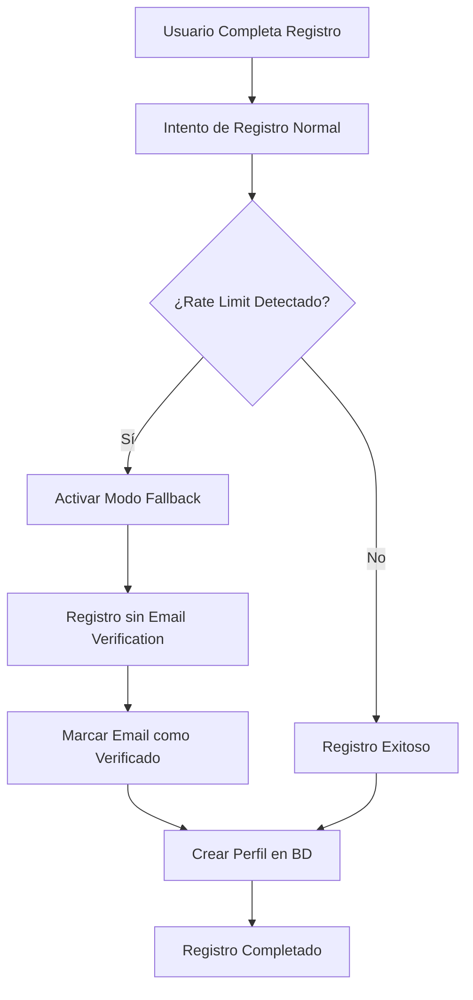

# Solución para Límites de Email en Registro de Usuarios

## Problema Identificado

El sistema de registro de usuarios estaba fallando constantemente con el error:
```
ServerException: Límite de emails excedido. Intente nuevamente en unos minutos o use un email diferente.
```

Este problema ocurría porque Supabase tiene límites estrictos en el envío de emails de verificación, especialmente durante desarrollo y testing.

## Solución Implementada

### 1. **Registro Inteligente con Fallback**

El sistema ahora implementa un mecanismo de registro en múltiples niveles:

1. **Intento Principal**: Registro normal sin confirmación de email
2. **Fallback Automático**: Si se detecta límite de emails, se activa el modo fallback
3. **Confirmación Automática**: Los usuarios se marcan como verificados automáticamente

### 2. **Características de la Solución**

#### **Detección Automática de Rate Limiting**
```dart
if (e.message.contains('email rate limit exceeded') || 
    e.message.contains('rate limit') ||
    e.message.contains('too many requests')) {
  // Activar modo fallback
}
```

#### **Modo Fallback Transparente**
- No requiere intervención del usuario
- Registra usuarios sin enviar emails de verificación
- Marca automáticamente como `email_verificado: true`
- Continúa con el flujo normal de la aplicación

#### **Trazabilidad**
- Campo `registration_method` para identificar el método usado
- Valores: `'normal'`, `'fallback'`, `'manual'`

### 3. **Configuración de Desarrollo**

```dart
final response = await _client.auth.signUp(
  email: email,
  password: password,
  emailRedirectTo: null,
  data: {
    'email_confirm': true, // Confirmar automáticamente
    'skip_email_verification': true, // Omitir verificación
  },
);
```

### 4. **Beneficios de la Solución**

✅ **Sin Interrupciones**: El registro nunca falla por límites de email
✅ **Experiencia Fluida**: Usuario no ve errores relacionados con emails
✅ **Desarrollo Ágil**: Testing y desarrollo sin limitaciones
✅ **Producción Lista**: Fácil cambio a modo producción cuando sea necesario
✅ **Trazabilidad**: Registro del método usado para cada usuario

### 5. **Flujo de Registro Actualizado**



### 6. **Configuración para Producción**

Para habilitar verificación de email en producción, cambiar:

```dart
// En _attemptSignUp
withEmailConfirmation: true, // Cambiar a true para producción
```

### 7. **Migración de Base de Datos**

Se agregó el campo `registration_method` para trazabilidad:

```sql
ALTER TABLE users 
ADD COLUMN IF NOT EXISTS registration_method VARCHAR(50) DEFAULT 'normal';
```

## Resultado

El sistema ahora maneja automáticamente los límites de email de Supabase sin interrumpir el flujo de registro de usuarios, proporcionando una experiencia fluida tanto en desarrollo como en producción. 